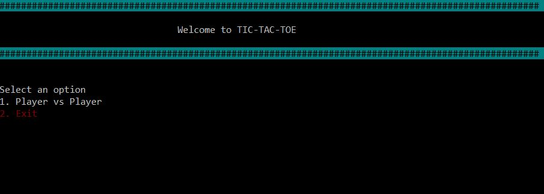
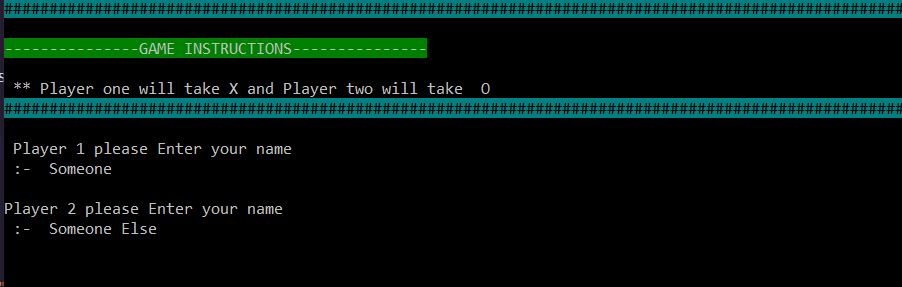
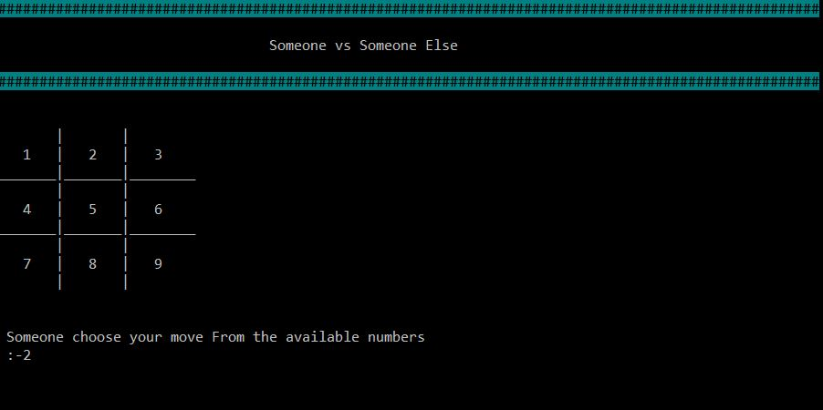
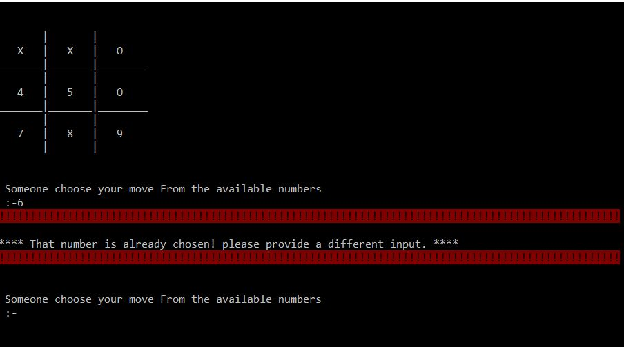
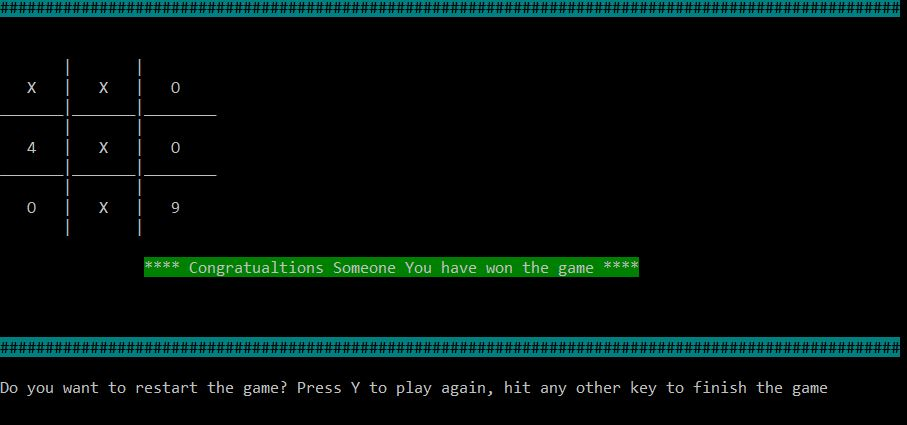
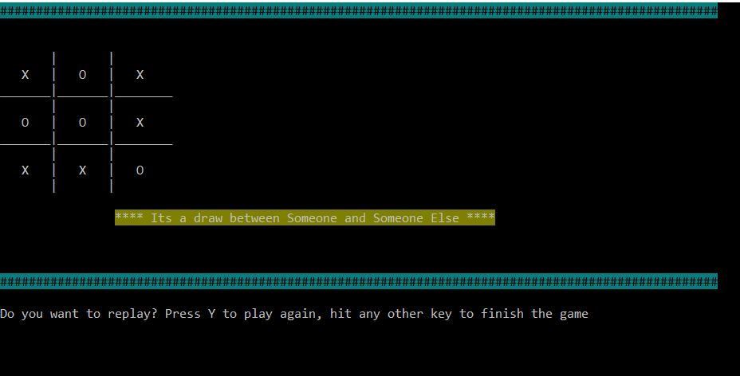

# Tic Tac Toe Project

> In this project, it is assigned for us to create a Tic Tac Toe game using only Ruby to increase our knowledge on the OOP concepts. 
This project was split in 4 milestones, which were:
- Setting up the project
- Designing the user interface
- Creating the game logic
- Writing the game instructions

> The main goal of this project is to asure I master the methods ruby provides and to learn how to replicate them using basic coding knowledge.
### Demonstration

### Screenshot
## Welcome Screen

## An interface to get players name

## Get players move

## Displays Error

## Displays Win or draw cases

## Built With

- Ruby
- colorize gem
- Rubocop

### Prerequisites

- colorize gem
- Browser (Google Chrome, Mozilla Firefox, Safari or any other browser)

### Setup
- Open Terminal

- Run git clone https://github.com/abouhid/Tic-Tac-Toe.git
- Run `cd Tic-Tac-Toe`
- Run `ruby bin/main`

### Game instructions
  The player has the option to play or to exit. If the player decides to play, these steps follow:
- Both players choose their names to play against each other
- A 3x3 grid is displayed on the terminal and the first player chooses a number to place his symbol on that number's position
- The players take turns in order to try to make an uninterrupted row, column or diagonal.
- The player which does that first wins!
- If all spaces are chosen and there is no winner, it is considered a draw
- On both situations above, there is the option to restart the game
- Have fun!

### Authors

👤 **Alexandre Bouhid**

- Github: [@abouhid](https://github.com/abouhid)
- LinkedIn: [Alexandre Bouhid](https://www.linkedin.com/in/alexandrebouhid/)

👤 **Bereket Beshane**

- Github: [@berabjesus](https://github.com/Berabjesus)
- Twitter: [@bereket_ababu_b](https://twitter.com/bereket_ababu_b)
- Linkedin: [linkedin](https://www.linkedin.com/in/bereket-beshane-a1b75a1a9/)

## 🤝 Contributing

Contributions, issues and feature requests are welcome!

Feel free to check the [issues page](https://github.com/abouhid/Tic-Tac-Toe/issues).

## Show your support

Give a ⭐️ if you like this project!

## Acknowledgments

- Microverse
- GitHub
- TheOdinProject
- Ruby

## 📝 License

This project is [MIT](lic.url) licensed.
